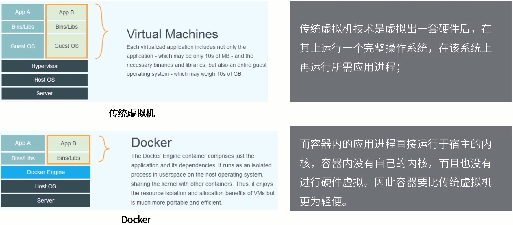
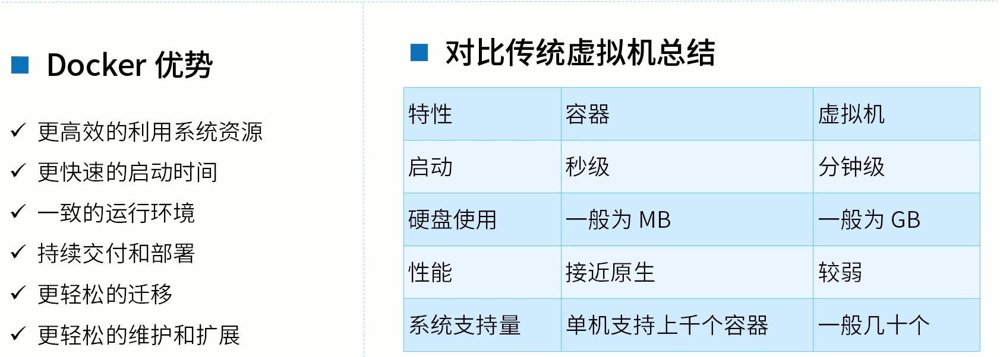
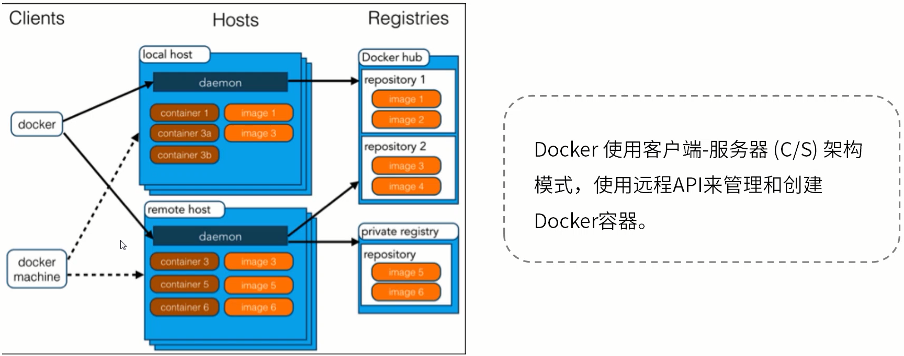
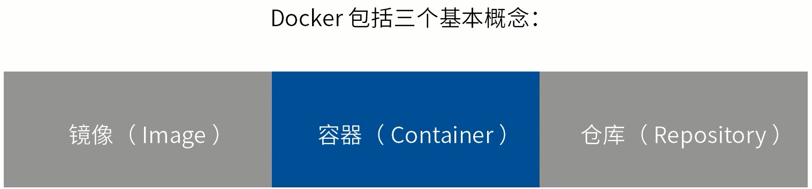

## 容器化技术专题

### Docker 基础概念

**Docker是什么？**

Docker最初是dotCloud公司创始人Solomon Hykes在法国期间发起的一个公司内部项目，它是基于dotCloud公司多年云服务技术的一次革新，并于2013年3月以 Apache 2.0 授权协议开源，主要项目代码在Github上进行维护。Docker项目后来还加入了Linux基金会，并成立推动开放容器联盟 (OCI)。

Docker使用Google公司推出的 <u>Go 语言</u> 进行开发实现，基于Linux内核的cgroup，namespace，以及AUFS类的Union FS等技术，对进程进行封装隔离，属于操作系统层面的虚拟化技术。由于隔离的进程独立于宿主和其他的隔离进程，因此也称其为容器。容器化技术。

Docker在容器的基础上，进行了进一步的封装，从文件系统、网络互联到进程隔离等，极大的简化了容器的创建和维护，使得 **<u>Docker技术比虚拟机技术更为轻便、快捷</u>**。

**Docker和传统虚拟机**

**为什么要使用Docker ？**

**Docker的架构**

三大组件：

客户端：Clients、主机：Hosts、仓库：Registries

工作模式：

Docker使用客户端-服务器 (C/S) 架构模式，使用远程API来管理和创建Docker容器。

Docker镜像 image，是用于创建 Docker 容器的一个模板。Docker容器是独立运行的一个或者是一组应用。Docker客户端通过命令行或者其他的工具使用Docker API与Docker的守护进程进行通信。Docker 主机 Hosts，一个物理主机或者虚拟机用于执行Docker守护进程的容器。Docker 仓库 用来保存镜像，可以理解为代码管理控制中的代码仓库，例如：Github。Docker machine是一个简化了Docker 安装的命令行工具，通过一个简单的命令行即可以在相关的平台上安装Docker，例如：Virtualbox。

Docker的基本概念

镜像-Image、容器-Container、仓库-Repository

理解了这三个概念，就理解了Docker的整个生命周期。

1. Docker镜像

   我们都知道，操作系统分为内核和用户空间。对于Linux而言，内核启动后，会挂载root文件系统为其提供用户空间支持。而Docker镜像-Image，就相当于是一个root文件系统。例如官方镜像centos：7.6就包含了完整的一套centos7.6最小系统的root文件系统。

   Docker镜像是一个特殊的文件系统，除了提供容器运行时所需的程序、库、资源、配置等文件外，还包含了一些为运行时准备的一些配置参数 (如匿名卷、环境变量、用户等)。镜像不包含任何动态数据，其内容在构建之后也不会被改变。

2. Docker镜像分层存储

   因为镜像包含操作系统完整的root文件系统，其体积往往是庞大的，因此在Docker设计时将其设计为 分层存储 的架构。镜像只是一个虚拟的概念，其实际体现并非由一个文件组成，而是由一组文件系统组成，或者说，由多层文件系统联合组成。

   镜像构建时，会一层层构建，前一层时后一层的基础。每一层构建完就不会再发生改变，后一层上的任何改变只会发生在自己这一层。在构建镜像的时候，需要额外小心，每一层尽量只包含该层需要添加的东西，任何额外的东西应该在该层构建结束前清理掉。

   分层存储的特征还使得镜像的复用、定制变得更为容易。甚至可以用之前构建好的镜像作为基础层，然后进一步添加新的层，以定制自己所需的内容，构建新的镜像。

3. Docker容器

   镜像-Image 和 容器-Container 的关系，就像Java中的类和实例一样，镜像是静态的定义，容器是镜像运行时的实体。容器可以被创建、启动、停止、删除、暂停等。

   前面讲过镜像使用的是分层存储，容器也是如此。每一个容器运行时，是以镜像为基础层，在其上创建一个当前容器的存储层，我们可以称这个为容器运行时读写而准备的存储层为容器存储层。

   容器存储层的生存周期和容器一样，容器消亡时，容器存储层也随之消亡。因此，任何保存于容器存储层的信息都会随容器删除而丢失。

   按照 Docker 最佳实践的要求，容器不应该向其存储层内写入任何数据，容器存储层要保持无状态化。所有的文件写入操作，都应该使用 Volume 数据卷、或者绑定宿主目录，在这些位置的读写会跳过容器存储层，直接对宿主 (或者网络存储) 发生读写，其性能和稳定性更高。

   数据卷的生存周期独立于容器，容器消亡，数据卷不会消亡。因此，使用数据卷后，容器删除或者重新运行之后，数据却不会丢失。

4. Docker 仓库

   镜像构建完成后，可以很容易的在当前宿主机上运行，但是，如果需要在其他服务器上使用这个镜像，我们就需要一个集中的存储、分发镜像的服务，Docker Registry 就是这样的服务。

   一个 Docker Registry 中可以包含多个仓库 - Repository；每个仓库可以包含多个标签 - Tag；每个标签对应一个镜像。

   通常，一个仓库会包含同一个软件不同版本的镜像，而标签就常用于对应该软件的各个版本。我们可以通过   <仓库名>：<标签> 的格式来指定具体是这个软件的哪个版本的镜像。如果不给出标签，将以latest作为默认标签。

   例如：

   以centos镜像为例，centos 是仓库的名字，其内容包含有不同的版本标签，如：6.9、7.5。我们可以通过 centos：6.9，或者centos：7.5 来具体指定所需哪个版本的镜像。如果忽略了标签，比如 centos，那默认就是 centos：latest。

   仓库名经常以 两段式路径 的形式出现，例如 study/nginx，前者往往意味着 Docker Registry 多用户环境下的用户名，后者则往往是对应的软件名。但这并非绝对，取决于所使用的具体 Docker Registry 的软件或者服务。

5. Docker 仓库

   Docker Registry 公开仓库

   常用的 Registry 是官方的 Docker Hub，这也是默认的 Registry。除此以外，还有 CoreOS 的 Quay.io，CoreOS 相关的镜像存储在这里；Google 的 Google Container Registry，Kubernetes 的镜像使用的就是这个服务。

   国内的一些云服务商提供了针对 Docker Hub 的镜像服务，这些镜像服务被称为加速器。常见的有 阿里云加速器、DaoCloud 加速器 等。使用加速器会直接从国内的地址下载 Docker Hub 的镜像，比直接从 Docker Hub 下载速度会提高很多。

   国内也有一些云服务上提供类似于 Docker Hub 的公开服务。比如 网易云镜像服务、DaoCloud 镜像市场、阿里云镜像库 等。

6. Docker 仓库

   Docker Registry 私有仓库

   除了使用公开服务外，用户还可以在本地搭建私有 Docker Registry。Docker 官方提供了 Docker Registry 镜像，可以直接使用作为私有 Registry 服务。

   开源的 Docker Registry 镜像只提供了 Docker Registry API 的服务端实现，足以支持 Docker 命令，不影响使用。但不包含图形界面，以及镜像维护、用户管理、访问控制 等高级功能。在官方的商业化版本 Docker Trusted Registry 中，提供了这些高级功能。

   除了官方的 Docker Registry 外，还有第三方软件实现了 Docker Registry API，甚至提供了用户界面以及一些高级功能。例如：VMWare Harbor 和 Sonatype Neuxs。

以上详细的介绍了 Docker 以及为什么要使用 Docker，Docker 的优势等，并讲解了 Docker 的三个基本概念：镜像 - Image、容器 - Container、仓库 - Repository 以及 Docker 的生命周期。接下来进入实际操作阶段。

补充资料：

http://mp.weixin.qq.com/s?__biz=Mzg2OTA0Njk0OA==&mid=2247484921&idx=1&sn=d40518712a04b3c37d7c8fcd3e696e90&chksm=cea24a32f9d5c3243db78a227ba4e77618e679bbc856cf1974fccbd474c44847672f21658147&mpshare=1&scene=24&srcid=0405DSzBYi41r9pzN3EirUJr#rd
