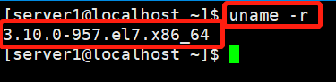

## 容器化技术专题

### Docker 安装及加速

在学习安装 Docker 之前，先来了解下 Docker 的版本命名 规则：


**本节讨论 Docker CE Stable 版本的安装。**

官方网站上有各种环境下的 安装指南，这里主要介绍 Docker CE 在 Linux 上的安装。

官方安装指南地址：[Docker Installation](<https://docs.docker.com/install/>)


#### Centos 安装 Docker

1. 系统要求

   **Docker CE 支持 64 位版本 CentOS 7，并且要求内核版本不低于3.10**。

2. 卸载旧版本

   旧版本的 Docker 称为 docker 或者 docker-engine，使用一下命令卸载旧版本：

   > sudo yum remove docker docker-common docker-selinux docker-engine

3. 使用 yum 安装

   > sudo yum install docker-ce


需要提前准备好 Centos 的环境，可以使用 Virtualbox + Xshell 的方案实施。

在本机上，我使用 centos_1 在 Virtualbox 中开机，并使用 Xshell 进行连接操作。当前环境为新安装系统。

1. 首先验证系统内核版本是否支持 Docker CE 的。通过命令查看：内核版本符合要求

   > uname -r

   

   

2. 如果服务器上已经安装了 Docker 环境，为确保 Docker 为最新版本，可以先卸载旧版本，再安装新版本。

   Uninstall old versions

   Older versions of Docker were called `docker` or `docker-engine`. If these are installed, uninstall them, along with associated dependencies.

   ```
   $ sudo yum remove docker \
                     docker-client \
                     docker-client-latest \
                     docker-common \
                     docker-latest \
                     docker-latest-logrotate \
                     docker-logrotate \
                     docker-engine
   ```

   It’s OK if `yum` reports that none of these packages are installed.

   The contents of `/var/lib/docker/`, including images, containers, volumes, and networks, are preserved. The Docker CE package is now called `docker-ce`.

   

   

3. Docker 安装新版本

   注意：如果安装的是 centos 7 minimal 的版本，执行安装提示 “没有可用软件包”，这个时候需要安装必要的软件依赖以及更新增加 docker-ce yum 源。

   Install Docker CE

   You can install Docker CE in different ways, depending on your needs:

   - Most users [set up Docker’s repositories](https://docs.docker.com/install/linux/docker-ce/centos/#install-using-the-repository) and install from them, for ease of installation and upgrade tasks. This is the recommended approach.
   - Some users download the RPM package and [install it manually](https://docs.docker.com/install/linux/docker-ce/centos/#install-from-a-package) and manage upgrades completely manually. This is useful in situations such as installing Docker on air-gapped systems with no access to the internet.
   - In testing and development environments, some users choose to use automated [convenience scripts](https://docs.docker.com/install/linux/docker-ce/centos/#install-using-the-convenience-script) to install Docker.

   ##### 

   #### Install using the repository

   Before you install Docker CE for the first time on a new host machine, you need to set up the Docker repository. Afterward, you can install and update Docker from the repository.

   #### SET UP THE REPOSITORY

   1. Install required packages. `yum-utils` provides the `yum-config-manager` utility, and `device-mapper-persistent-data` and `lvm2` are required by the `devicemapper` storage driver.

      ```
      $ sudo yum install -y yum-utils \
        device-mapper-persistent-data \
        lvm2
      ```

   2. Use the following command to set up the **stable** repository.

      ```
      $ sudo yum-config-manager \
          --add-repo \
          https://download.docker.com/linux/centos/docker-ce.repo
      ```

   做 1 第一步操作时，需要注意network connection，保证可以连接外网。正常的话，应该不会出问题，这里不截图了。

   做 2 步操作类似，截图：

   

   

   以下是可选，默认不需要开启。

   **Optional**: Enable the **nightly** or **test** repositories.

   These repositories are included in the `docker.repo` file above but are disabled by default. You can enable them alongside the stable repository. The following command enables the **nightly** repository.

   ```
   $ sudo yum-config-manager --enable docker-ce-nightly
   ```

   To enable the **test** channel, run the following command:

   ```
   $ sudo yum-config-manager --enable docker-ce-test
   ```

   You can disable the **nightly** or **test** repository by running the `yum-config-manager` command with the `--disable` flag. To re-enable it, use the `--enable` flag. The following command disables the **nightly**repository.

   ```
   $ sudo yum-config-manager --disable docker-ce-nightly
   ```

   [Learn about **nightly** and **test** channels](https://docs.docker.com/install/).

   

   #### INSTALL DOCKER CE

   1. Install the *latest version* of Docker CE and containerd, or go to the next step to install a specific version:

      ```
      $ sudo yum install docker-ce docker-ce-cli containerd.io
      ```

      If prompted to accept the GPG key, verify that the fingerprint matches`060A 61C5 1B55 8A7F 742B 77AA C52F EB6B 621E 9F35`, and if so, accept it.

      > Got multiple Docker repositories?
      >
      > If you have multiple Docker repositories enabled, installing or updating without specifying a version in the `yum install` or `yum update` command always installs the highest possible version, which may not be appropriate for your stability needs.

   以上步骤是通过更新 yum 源的方式，进行 Docker CE 的安装。

   其实也可以下载 package，来进行安装

   还可以通过，下载安装脚本的方式，进行 Docker CE 的安装。

   

4. 使用脚本安装

   在测试或者开发环境中，Docker 官方为了简化安装流程，提供了一套便捷的安装脚本，CentOS 系统上可以使用这套脚本安装：

   ### Install using the convenience script

   Docker provides convenience scripts at [get.docker.com](https://get.docker.com/) and [test.docker.com](https://test.docker.com/) for installing edge and testing versions of Docker CE into development environments quickly and non-interactively. The source code for the scripts is in the [`docker-install` repository](https://github.com/docker/docker-install). **Using these scripts is not recommended for production environments**, and you should understand the potential risks before you use them:

   - The scripts require `root` or `sudo` privileges to run. Therefore, you should carefully examine and audit the scripts before running them.
   - The scripts attempt to detect your Linux distribution and version and configure your package management system for you. In addition, the scripts do not allow you to customize any installation parameters. This may lead to an unsupported configuration, either from Docker’s point of view or from your own organization’s guidelines and standards.
   - The scripts install all dependencies and recommendations of the package manager without asking for confirmation. This may install a large number of packages, depending on the current configuration of your host machine.
   - The script does not provide options to specify which version of Docker to install, and installs the latest version that is released in the “edge” channel.
   - Do not use the convenience script if Docker has already been installed on the host machine using another mechanism.

   This example uses the script at [get.docker.com](https://get.docker.com/) to install the latest release of Docker CE on Linux. To install the latest testing version, use [test.docker.com](https://test.docker.com/) instead. In each of the commands below, replace each occurrence of `get` with `test`.

   > **Warning**:
   >
   > Always examine scripts downloaded from the internet before running them locally.

   ```
   $ curl -fsSL https://get.docker.com -o get-docker.sh
   $ sudo sh get-docker.sh
   
   <output truncated>
   ```

   If you would like to use Docker as a non-root user, you should now consider adding your user to the “docker” group with something like:

   ```
     sudo usermod -aG docker your-user
   ```

   Remember to log out and back in for this to take effect!

   > **Warning**:
   >
   > Adding a user to the “docker” group grants them the ability to run containers which can be used to obtain root privileges on the Docker host. Refer to [Docker Daemon Attack Surface](https://docs.docker.com/engine/security/security/#docker-daemon-attack-surface) for more information.

   Docker CE is installed. It starts automatically on `DEB`-based distributions. On `RPM`-based distributions, you need to start it manually using the appropriate `systemctl` or `service` command. As the message indicates, non-root users can’t run Docker commands by default.

   

   执行这个命令后，脚本就会自动的将一切准备就绪，并且把 Docker CE 的 Edge 版本安装在系统中。

   

5. 启动 Docker CE

   Start Docker.

   ```
   $ sudo systemctl start docker
   ```

   Verify that Docker CE is installed correctly by running the `hello-world` image.

   ```
   $ sudo docker run hello-world
   ```

   设置开机启动

   ```
   $ sudo systemctl enable docker
   ```

   开启 docker 后，可以查看 docker 详细信息

   ```
   $ sudo docker info
   ```

   例如：使用 docker 版本，server 的版本信息。

   ```
   $ sudo docker --version
   ```

   

6. 通过安装 package 的方式进行安装

   ##### Install from a package

   If you cannot use Docker’s repository to install Docker, you can download the `.rpm` file for your release and install it manually. You need to download a new file each time you want to upgrade Docker CE.

   1. Go to <https://download.docker.com/linux/centos/7/x86_64/stable/Packages/> and download the `.rpm` file for the Docker version you want to install.

      > **Note**: To install a **nightly** or **test** (pre-release) package, change the word `stable` in the above URL to `nightly` or `test`. [Learn about **nightly** and **test** channels](https://docs.docker.com/install/).

   2. Install Docker CE, changing the path below to the path where you downloaded the Docker package.

      ```
      $ sudo yum install /path/to/package.rpm
      ```

      Docker is installed but not started. The `docker` group is created, but no users are added to the group.

   3. Start Docker.

      ```
      $ sudo systemctl start docker
      ```

   4. Verify that Docker CE is installed correctly by running the `hello-world` image.

      ```
      $ sudo docker run hello-world
      ```

      This command downloads a test image and runs it in a container. When the container runs, it prints an informational message and exits.

   Docker CE is installed and running. You need to use `sudo` to run Docker commands. Continue to [Post-installation steps for Linux](https://docs.docker.com/install/linux/linux-postinstall/) to allow non-privileged users to run Docker commands and for other optional configuration steps.

   

7. 关于 Docker CE 卸载

   Docker CE is installed. It starts automatically on `DEB`-based distributions. On `RPM`-based distributions, you need to start it manually using the appropriate `systemctl` or `service` command. As the message indicates, non-root users can’t run Docker commands by default.

   #### UPGRADE DOCKER AFTER USING THE CONVENIENCE SCRIPT

   If you installed Docker using the convenience script, you should upgrade Docker using your package manager directly. There is no advantage to re-running the convenience script, and it can cause issues if it attempts to re-add repositories which have already been added to the host machine.

   ## Uninstall Docker CE

   1. Uninstall the Docker package:

      ```
      $ sudo yum remove docker-ce
      ```

   2. Images, containers, volumes, or customized configuration files on your host are not automatically removed. To delete all images, containers, and volumes:

      ```
      $ sudo rm -rf /var/lib/docker
      ```

   You must delete any edited configuration files manually.

   

8. 建立 docker 用户组

   默认情况下，docker 命令会使用 Unix socket 与 Docker 引擎通讯。而只有 root 用户和 docker 组的用户才可以访问 Docker 引擎的 Unix socket。一般 Linux 系统上不会直接使用 root 用户进行操作。因此，需要将使用 docker 的用户加入 docker 用户组。

   ```
   sudo groupadd docker				#建立 docker 组
   sudo usermod -aG docker $USER		#将当前用户加入 docker 组
   ```

   

9. 测试 Docker 是否安装正确

   ```
   sudo docker run hello-world			#启动一个基于 hello-world 镜像的容器
   ```

   若能正常输出信息，则说明安装成功。

   

   

10. 若是在国内使用脚本安装，需要配置镜像加快安装速度

    ```
    $ curl -fsSL https://get.docker.com -o get-docker.sh
    $ sudo sh get-docker.sh --mirror Aliyun					#配置阿里云镜像
    ```

    

11. 若在国内，默认还是会从 Docker Hub 拉取镜像，需要配置国内的一些镜像加速服务网址

    镜像加速器：

    国内从 Docker Hub 拉取镜像有时会遇到困难，此时可以配置镜像加速器。Docker 官方和国内很多云服务商都提供了国内加速器服务，例如：

    - Docker 官方提供的中国 registry mirror
    - 阿里云加速器
    - DaoCloud 加速器
    - 163 加速器

    接下来以 163 加速器来举例说明。

    

12. CentOS 7 配置镜像加速

    对于使用 systemd 的系统，请在 /etc/docker/daemon.json 中写入如下内容 (如果文件不存在，请新建该文件)

    ```
    {
    	"registry-mirrors":[
    		"http://hub-mirror.c.163.com"
    	]
    }
    ```

    重启服务生效

    ```
    sudo systemctl daemon-reload
    sudo systemctl restart docker
    ```

    默认的 docker registry 镜像地址，可以通过 sudo docker info 命令来查看。

    

13. 通过命令查看 docker 的镜像文件

    ```
    sudo docker images				#查看 docker 镜像文件
    或者
    sudo docker image ls			#查看 docker 镜像文件
    sudo docker rmi hello-world		#删除 docker 镜像文件
    #如果删除镜像提示错误，已经有一个 container 实例了
    sudo docker ps -a				#查看 docker 所有的容器实例
    sudo docker rm -f [id]			#通过 id 删除 docker 容器的实例
    ```

    

这一节，详细介绍了 Docker 在 Centos 7 环境下的安装及镜像加速配置。需要实际动手操作学会安装和配置 Docker 环境。并在接下来通过已经搭建好的 Docker 环境去运行 docker 镜像。