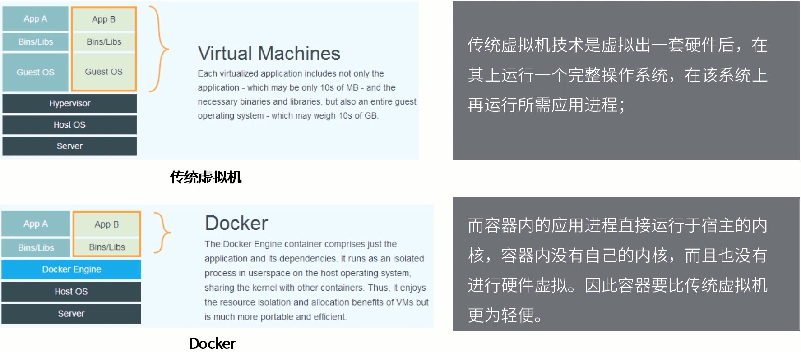
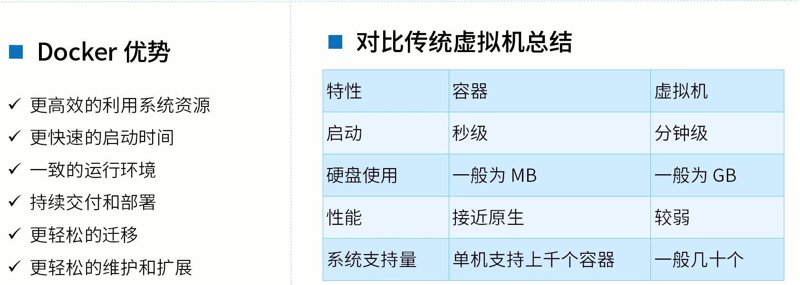
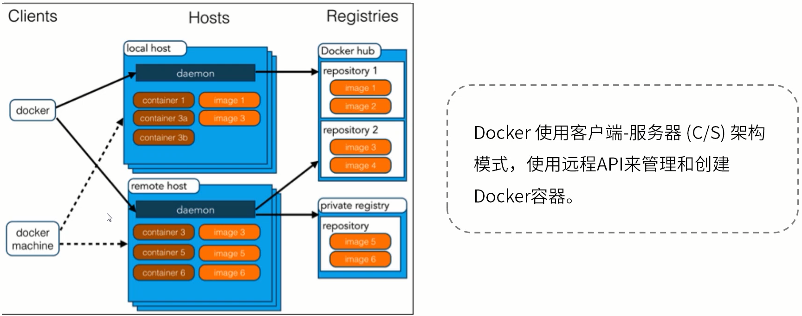

## 容器化技术专题

### Docker 基础概念

**Docker是什么？**

Docker最初是dotCloud公司创始人Solomon Hykes在法国期间发起的一个公司内部项目，它是基于dotCloud公司多年云服务技术的一次革新，并于2013年3月以 Apache 2.0 授权协议开源，主要项目代码在Github上进行维护。Docker项目后来还加入了Linux基金会，并成立推动开放容器联盟 (OCI)。

Docker使用Google公司推出的 <u>Go 语言</u> 进行开发实现，基于Linux内核的cgroup，namespace，以及AUFS类的Union FS等技术，对进程进行封装隔离，属于操作系统层面的虚拟化技术。由于隔离的进程独立于宿主和其他的隔离进程，因此也称其为容器。容器化技术。

Docker在容器的基础上，进行了进一步的封装，从文件系统、网络互联到进程隔离等，极大的简化了容器的创建和维护，使得 **<u>Docker技术比虚拟机技术更为轻便、快捷</u>**。

**Docker和传统虚拟机**

**为什么要使用Docker ？**

**Docker的架构**

三大组件：

客户端：Clients、主机：Hosts、仓库：Registries

工作模式：

Docker使用客户端-服务器 (C/S) 架构模式，使用远程API来管理和创建Docker容器。

Docker镜像 image，是用于创建 Docker 容器的一个模板。Docker容器是独立运行的一个或者是一组应用。Docker客户端通过命令行或者其他的工具使用Docker API与Docker的守护进程进行通信。Docker 主机 Hosts，一个物理主机或者虚拟机用于执行Docker守护进程的容器。Docker 仓库 用来保存镜像，可以理解为代码管理控制中的代码仓库，例如：Github。Docker machine是一个简化了Docker 安装的命令行工具，通过一个简单的命令行即可以在相关的平台上安装Docker，例如：Virtualbox。

Docker的基本概念

镜像-Image、容器-Container、仓库-Repository

理解了这三个概念，就理解了Docker的整个生命周期。

1. Docker镜像

   我们都知道，操作系统分为内核和用户空间。对于Linux而言，内核启动后，会挂载root文件系统为其提供用户空间支持。而Docker镜像-Image，就相当于是一个root文件系统。例如官方镜像centos：7.6就包含了完整的一套centos7.6最小系统的root文件系统。

   Docker镜像是一个特殊的文件系统，除了提供容器运行时所需的程序、库、资源、配置等文件外，还包含了一些为运行时准备的一些配置参数 (如匿名卷、环境变量、用户等)。镜像不包含任何动态数据，其内容在构建之后也不会被改变。

2. Docker镜像分层存储

   因为镜像包含操作系统完整的root文件系统，其体积往往是庞大的，因此在Docker设计时将其设计为 分层存储 的架构。镜像只是一个虚拟的概念，其实际体现并非由一个文件组成，而是由一组文件系统组成，或者说，由多层文件系统联合组成。

   镜像构建时，会一层层构建，前一层时后一层的基础。每一层构建完就不会再发生改变，后一层上的任何改变只会发生在自己这一层。在构建镜像的时候，需要额外小心，每一层尽量只包含该层需要添加的东西，任何额外的东西应该在该层构建结束前清理掉。

   分层存储的特征还使得镜像的复用、定制变得更为容易。甚至可以用之前构建好的镜像作为基础层，然后进一步添加新的层，以定制自己所需的内容，构建新的镜像。

3. Docker容器

   镜像-Image 和 容器-Container 的关系，就像Java中的类和实例一样，镜像是静态的定义，容器是镜像运行时的实体。容器可以被创建、启动、停止、删除、暂停等。

   前面讲过镜像使用的是分层存储，容器也是如此。每一个容器运行时，是以镜像为基础层，在其上创建一个当前容器的存储层，我们可以称这个为容器运行时读写而准备的存储层为容器存储层。

   容器存储层的生存周期和容器一样，容器消亡时，容器存储层也随之消亡。因此，任何保存于容器存储层的信息都会随容器删除而丢失。

4. 

5. 

补充资料：

http://mp.weixin.qq.com/s?__biz=Mzg2OTA0Njk0OA==&mid=2247484921&idx=1&sn=d40518712a04b3c37d7c8fcd3e696e90&chksm=cea24a32f9d5c3243db78a227ba4e77618e679bbc856cf1974fccbd474c44847672f21658147&mpshare=1&scene=24&srcid=0405DSzBYi41r9pzN3EirUJr#rd

